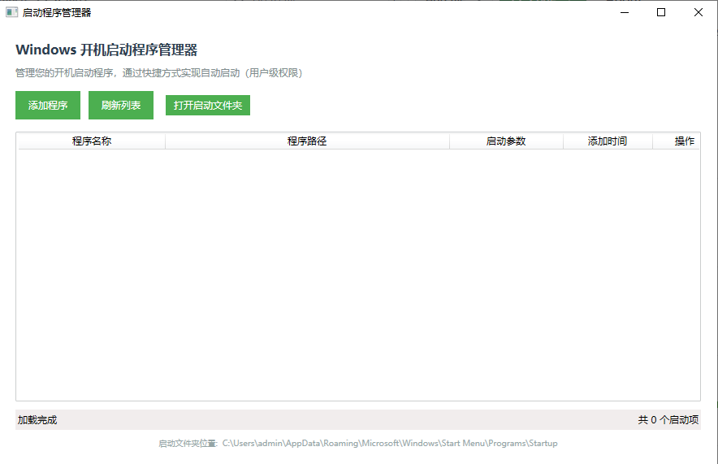

# Windows 启动程序管理器

一个简单易用的Windows开机启动程序管理工具，通过快捷方式实现自启动管理（用户级权限）。


## 界面预览



## 功能特性

- ✅ 查看当前所有开机启动项
- ✅ 添加新的启动程序
- ✅ 删除不需要的启动项
- ✅ 支持启动参数设置
- ✅ 用户友好的图形界面
- ✅ 无需管理员权限
- ✅ 通过快捷方式实现启动

## 系统要求

- Windows 10/11
- .NET 6.0 Runtime
- 普通用户权限即可

## 使用说明

### 启动文件夹位置

程序管理以下两个启动文件夹：

- **当前用户**: `%userprofile%\AppData\Roaming\Microsoft\Windows\Start Menu\Programs\Startup`
- **所有用户**: `%ProgramData%\Microsoft\Windows\Start Menu\Programs\Startup` (只读显示)

### 主要功能

1. **查看启动项**
   - 启动程序后自动加载所有启动项
   - 显示程序名称、路径、启动参数和添加时间
   - 支持按列排序

2. **添加启动项**
   - 点击"添加程序"按钮
   - 选择要添加的可执行文件
   - 设置程序名称和启动参数（可选）
   - 确认添加

3. **删除启动项**
   - 在列表中找到要删除的项目
   - 点击对应行的"删除"按钮
   - 确认删除操作

4. **其他功能**
   - 刷新列表：重新加载启动项
   - 打开启动文件夹：直接打开系统启动文件夹

## 编译和运行

### 开发环境要求

- Visual Studio 2022 或 Visual Studio Code
- .NET 6.0 SDK
- Windows 10/11 操作系统

### 快速开始

1. **使用批处理文件（推荐）**
   ```bash
   # 编译并运行
   build.bat

   # 发布独立可执行文件
   publish.bat

   # 测试应用程序
   test.bat
   ```

2. **手动编译**
   ```bash
   # 进入项目目录
   cd "e:\cursor 开发\Upstart"

   # 编译项目
   dotnet build StartupManager.csproj

   # 运行程序
   dotnet run --project StartupManager.csproj
   ```

### 发布程序

创建独立可执行文件：

```bash
dotnet publish StartupManager.csproj -c Release -r win-x64 --self-contained true -p:PublishSingleFile=true -o publish
```

发布后的可执行文件位于 `publish\StartupManager.exe`，可以在没有安装.NET Runtime的Windows系统上运行。

## 技术实现

- **框架**: WPF (.NET 6.0)
- **语言**: C#
- **快捷方式操作**: Windows Script Host Object Model (IWshRuntimeLibrary)
- **文件操作**: System.IO
- **UI框架**: WPF with MVVM pattern

## 故障排除

### 常见问题

1. **编译失败 - COM引用错误**
   - 确保使用.NET 6.0 SDK
   - 项目已更新为使用PowerShell创建快捷方式，无需COM引用

2. **应用程序无法启动**
   - 检查是否安装了.NET 6.0 Runtime
   - 确保Windows版本支持.NET 6.0

3. **无法创建快捷方式**
   - 检查启动文件夹是否存在写入权限
   - 确保PowerShell执行策略允许脚本运行

4. **快捷方式解析失败**
   - 某些第三方创建的快捷方式可能无法正确解析
   - 手动删除有问题的快捷方式文件

### 权限说明

- 程序运行只需要普通用户权限
- 只能管理当前用户的启动项
- 无法修改系统级启动项（需要管理员权限）

## 注意事项

1. 本程序只能管理用户级启动项，无法修改系统级启动项
2. 添加的启动项通过快捷方式(.lnk)实现
3. 删除启动项时会直接删除对应的快捷方式文件
4. 建议定期检查和清理不需要的启动项以提高系统启动速度
5. 程序使用PowerShell创建和解析快捷方式，确保系统允许PowerShell脚本执行


### v1.0.0 (2025-01-24)
- 初始版本发布
- 基本的启动项管理功能
- 用户友好的图形界面
- 支持添加、删除、查看启动项
